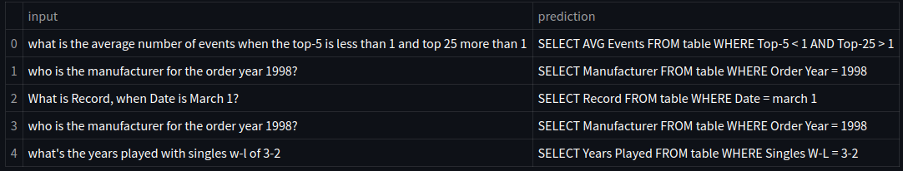

# ***Text2SQL Generator***
***The Text2SQL Generator is a project designed to bridge the gap between natural language and database querying by converting plain English text prompts into SQL commands. By leveraging the power of Transformer-based models, this tool simplifies database interaction for users without SQL expertise.***

## **Prediction Samples**
<p align="center">  </p>

## **Project Organization**
------------

    ├── LICENSE
    │
    ├── README.md               <- Documentation to get more information about the project.
    │
    ├── saved_models            <- Trained and serialized models.
    │
    ├── requirements.txt        <- The requirements file for reproducing the environment.
    │
    ├── src                     <- Source code for use in this project.
    │   ├── __init__.py         <- Makes src a Python module.
    |   |
    |   ├── train_tokenizer.py  <- Script to train a sentencepiece tokenizer on the dataset.
    |   |
    |   ├── dataset.py          <- Script to load and preprocess the dataset.
    |   |
    |   ├── model.py            <- Script that defines the transformer model.
    |   |
    |   ├── config.py           <- Contains all the basic parameters for training.
    │   │
    |   └── train.py            <- Script to train the model. 
    │
    ├── utils
    |   ├── examples.csv        <- CSV files with few example predictions.
    │   │
    |   └── examples.png        <- An image with few example predictions.
    |
    ├── engine.py               <- Script to perform inference on the trained model


## **Running on native machine**
### *dependencies*
* python3
### *pip packages*
```bash
pip install -r requirements.txt
```
## **Steps to train your own model**
 ### *Scripts*
 `src/train.py` - is used to train the model \
 `engine.py` - is used to perform inference \
